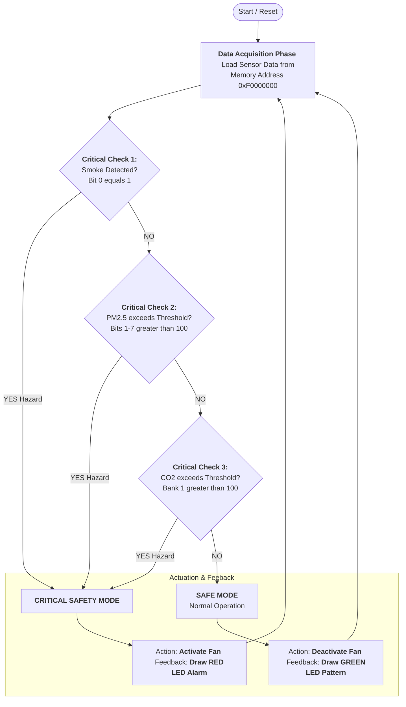
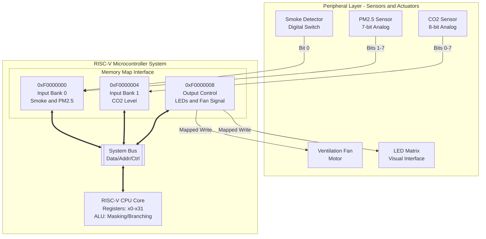

# Assignment 3: System Architecture and Implementation Blueprint of RISC-V based Embedded System Project

**Project Title:** Smart Corridor Ventilation & Air Quality Monitoring System

**Course:** CS-221 Computer Organization and Assembly Language
**Class/Section:** BSCS-3B
**Group Number:** 05

**Team Members:**

| Name                        | CMS-ID     | Role                              |     |
| :-------------------------- | :--------- | :-------------------------------- | :-- |
| **Faizan Anwar** (Team Rep) | **455259** | System Architect & Lead Developer |     |
| Abdul Moiz                  | 465932     | Hardware Simulation Specialist    |     |
| Muhammad Taha               | 467244     | Software Engineer (Assembly)      |     |
| Sham                        | 457919     | Testing & Validation Engineer     |     |

---

## 1. Introductory Overview of the Project

The **Smart Corridor Ventilation & Air Quality Monitoring System** is an embedded safety solution designed to address the critical issue of indoor air quality (IAQ) and fire safety in enclosed architectures. In modern smart buildings, delays in hazard detection can lead to severe health outcomes.

**Problem Statement:** Conventional ventilation systems are often manual or timer-based, failing to respond dynamically to real-time hazards such as elevated CO2 levels (hypercapnia risk), PM2.5 particulate accumulation, or smoke infiltration.

**High-Level Implementation Plan:**
Our system acts as an autonomous "reflex" mechanism for the building. It utilizes a **RISC-V processor** as the central control unit to ensure deterministic low-latency processing.
*   **Major Components:** RISC-V Core, Memory-Mapped Sensor Interface (Smoke, PM2.5, CO2), Actuator Control Interface (Fans), and Visual Status Indicators.
*   **Expected Outcomes:** A fail-safe system capable of detecting hazards within milliseconds and activating mitigative ventilation without human intervention.
*   **Key Assumptions:** The system operates in a continuous polling loop (Infinite Execution), assuming a stable power supply and that sensors provide linear analog-to-digital mappings.

---

## 2. Process-Flow Representation

The following diagram represents the deterministic operational sequence. The logic prioritizes immediate life-safety threats (Smoke) over long-term health hazards (CO2).



**Evaluation of Logical Dependencies:**
 The flow creates a "short-circuit" hierarchy. The check for Smoke is placed first to minimize instruction cycles before a critical alarm determination. This ensures that in a fire scenario, the system validates the threat in the fewest possible clock cycles ($O(1)$ constant time), meeting the rigorous timing constraints of safety systems.

---

## 3. RISC-V–Centred Architectural Layout

The system follows a modified Harvard Architecture approach (simulated) with Memory Mapped I/O, positioning the RISC-V core as the bridge between the physical world and digital logic.



**Component Justification:**
*   **RISC-V Core:** selected for its reduced instruction set, allowing for efficient, predictable code execution crucial for real-time monitoring.
*   **Memory Interfaces (MM1-MM3):** These decouple the processor from hardware implementation details. The CPU simply executes `LW` (Load Word) and `SW` (Store Word) instructions, treating hardware states as memory addresses.
*   **System Bus:** The backbone facilitating high-speed data transfer between the Core and the MMIO registers.

---

## 4. System Requirements Analysis

**Functional Requirements:**
1.  **Immediate Interrupt/Polling:** System must Poll sensors at least every 200ms to detect changes.
2.  **Multi-Hazard Logic:** System must be able to handle simultaneous hazards (e.g., Smoke + High CO2) without deadlock.
3.  **Visual Latency:** LED Matrix update latency must be $< 100ms$ to provide immediate visual feedback to occupants.

**Constraints & System Boundaries:**
*   **Power Usage:** As an always-on embedded system, the instruction loop must be efficient to minimize dynamic power consumption (switching activity).
*   **Accuracy Thresholds:**
    *   PM2.5 Threshold: $> 100 \mu g/m^3$
    *   CO2 Threshold: $> 1000 ppm$ (Scaled to 100 in simulation register).
*   **Cost Limitations:** The design minimizes complex floating-point units (FPU) by using integer arithmetic and bitwise logic, allowing it to run on low-cost RISC-V integer (RV32I) cores.

---

## 5. Hardware–Software Partitioning

This design uses a **Software-Driven Control** approach on **General Purpose Hardware**.

| Component/Function | Partition | Implementation Detail |
| :--- | :--- | :--- |
| **Logic Core** | **Software** | The decision-making (If Smoke -> then Alarm) is flexible code running on the RISC-V Core, allowing for easy updates to thresholds. |
| **Bitwise Masking** | **Software** | Instructions like `AND`, `SRLI` are used to "slice" the raw data word into meaningful sensor values. |
| **Sensor Interface** | **Hardware** | Physical A/D conversion is abstracted as hardware registers. |
| **Actuator Drive** | **Hardware** | High-current switching for the Fan is handled by hardware logic triggered by the software writing to the specific memory address. |

---

## 6. Computational Algorithm Implementation Plan

**Implementation Strategy:**
We have opted for a **Direct Assembly Implementation** (Native RISC-V) rather than compiling from High-Level Language (C/C++).
*   **Reasoning:** Direct assembly allows for precise control over register allocation and instruction scheduling. In a safety-critical loop, avoiding the overhead of a compiler's prologue/epilogue sequences ensures minimum latency.
*   **Logic:** The algorithm relies heavily on **Bitwise Operations** (`AND`, `SRLI`) to parse the packed data from the memory-mapped registers.

**Core Code Snippets (Refined):**

*1. Sensor Polling & Smoke Check (Critical Path)*
```assembly
main_loop:
    li t0, SW0_BASE         # Load Base Address 0xF0000000
    lw s0, 0(t0)            # Read Raw Input (Smoke + PM2.5)
    
    li t1, 1                # Mask for Bit 0
    and a0, s0, t1          # Isolate Smoke Bit
    bnez a0, unsafe_mode    # Branch IMMEDIATELY if Smoke detected (Priority 1)
```

*2. PM2.5 Parsing (Data Extraction)*
```assembly
    srli a1, s0, 1          # Logical Shift Right by 1 to remove Smoke bit
    li t1, 0x7F             # Mask 0x7F (01111111) to isolate 7-bit value
    and a1, a1, t1          # a1 now holds clean PM2.5 value
    
    li t2, THRESH_PM25      # Load Safety Constant (100)
    bgt a1, t2, unsafe_mode # Compare and Branch
```

---

## 7. Hardware or Simulator Utilization Plan

**Selected Approach: Simulation-Based Demonstration**

**Feasibility Analysis:**
*   **Physical Hardware:** Prototyping with FPGA (for soft-core RISC-V) or discrete chips is cost-prohibitive and time-intensive for this semester's scope.
*   **Simulation (Ripes):** Offers bit-accurate visualization of the processor pipeline (`IF`, `ID`, `EX`, `MEM`, `WB`). This is superior for demonstrating *Architecture* concepts as it allows us to inspect the register file and memory map in real-time.

**Decision:** The final demonstration will be conducted using **Ripes** to showcase the assembly logic and memory interaction, supplemented by **Wokvi** (ESP32) to demonstrate the high-level IoT connectivity concept. This dual approach maximizes the technical breadth of the project.

---

## 8. Preliminary Testing and Validation Strategy

To ensure zero-defect reliability, we employ a bottom-up testing strategy.

**Testing Methodology:**
1.  **Unit Testing (Module Level):**
    *   *Masking Logic:* Verify `AND` operations correctly isolate bits 0, 1-7, and 0-7.
    *   *Branch Logic:* Manually inject values $99$ (Safe) and $101$ (Danger) into registers to verify conditional jumps.
2.  **Integration Testing (System Level):**
    *   Run the main loop. Toggle "Smoke" switch. **Metric:** LED Matrix must turn Red within 1 cycle.
    *   Simulate "Noisy Data" (random bits in unused regions). **Metric:** System should ignore bits outside the defined masks.

**Tools:**
*   **Ripes Simulator:** For architectural validation and step-by-step debugging.
*   **Wokvi:** For verifying the logic flow with high-level C++ code before translating to Assembly.

---
*Submitted by Group 05 for CS-221*
